HOUSING PRICE ANALYSIS
================
by Andrew Marcus

### 1. INTRODUCTION:

Feature engineering is an essential initial step in a machine learning project for cleaning data, identifying valuable features, and preparing data for machine learning training.  Data obtained from external sources may have poor quality for a number of reasons:  missing values, improper or inconsistent formatting, duplicate entries, and erroneous entries.  Without correcting these problems, machine learning algorithms may perform poorly or completely fail.  Once the data is cleaned, exploratory data analysis is performed to identify features valuable for business proposition and for machine learning algorithm to training quickly and accurately.  
Feature engineering can be performed systematically and by following a general procedure which may have three parts.
1. **Filtering Methods** (Sections 2 to 7).  A Filtering method employs a set of filters in progression to systematically eliminate errors, remove poor quality data, and select feature values based on sample statistics.  Common steps of the filtering method are removing duplicate entries, analyzing missing values, analyzing sample statistics (mean, variance, skew), pairwise correlation, and multicollinearity.  
2. **Wrapper Methods** (Section 6). The wrapper method selects subsets of features and trains machine algorithms to evaluate if features are useful for making predictions.  The wrapper methods employ different types of algorithms to search the parameter space and attempt to find the best set of parameters.  Examples of the search algorithms are Forward Selection, Reverse Selection, and Recursive Selection.  
3. **Embedded Methods** (Section 8).  The embedded uses machine learning algorithms that provide useful statistics measures like filtering methods and select valuable features like the wrapper methods.  Examples of embedded methods include Lasso Regression (LASSO) and Random Forest Regression. 

Cleaning data through filtering and exploratory data analysis is a great way to prepare cleaned data for wrapper and embedded methods.  This report illustrates some of the common procedures for feature engineering.

### 2. UNDERSTAND THE DATASET

Ames Housing Dataset ([Provided by Caltech's AIML](https://pg-p.ctme.caltech.edu/ai-machine-learning-bootcamp-online-certification-course?utm_source=google&utm_medium=cpc&utm_term=&utm_content=17662294253-138434474117-608348603030&utm_device=c&utm_campaign=Search-DataCluster-PG-AIML-AIMLDSA-CAIMLB-Caltech-US-Main-CaltechDomain-Catchment-adgroup-AIML-PG-DSA&gclid=CjwKCAjw3qGYBhBSEiwAcnTRLuklh4T20pV_lthfuf4a33JMrvxc4V04Elpz30nTQG5V52N_uHHvrxoCVCEQAvD_BwE)) has 79 feature variables consisting of 43 object dtypes (categorical and ordinal variables) and 36 numeric dtypes (continuous and ordinal variables).  19 features have null values.  Two features **PoolQC** and **Alley** have more than >90% of data missing and are candidates for dropping.  Other categorical and numerical features will require attention.  All features have more than 1 feature with cardinality > 1.  There are 25 features with cardinality >15 and these are our main continuous variables (**Neighborhood** with a cardinality=25 is actually categorical.  **PoolSize** while being continuous has a low cardinality of 8).     

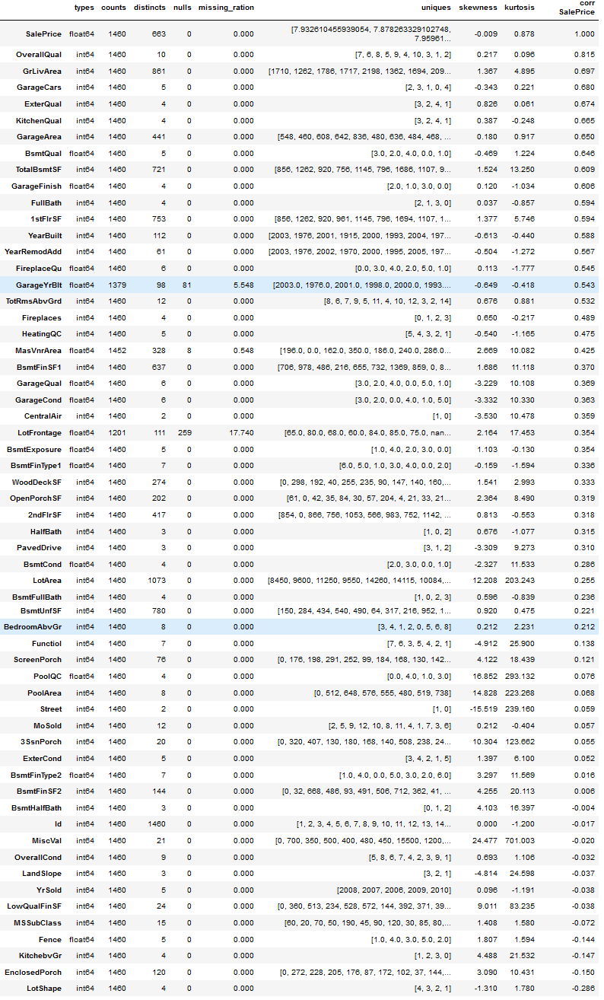<!-- -->
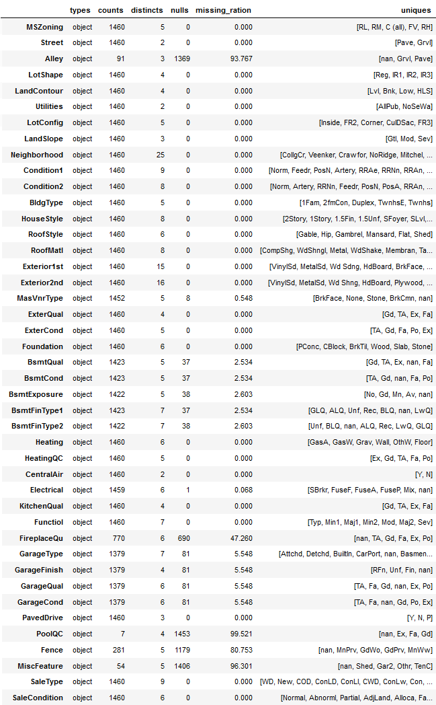<!-- -->

### 3. GENERATE A SEPARATE DATASET FOR NUMERICAL and CATEGORICAL VARIABLES

I separated data into two categories:  Categoricals and Numericals. In this case, Categoricals were nominal data lacking order. Numericals consisted of continuous variables read as Int64 and Float64 and ordinal variables read as Object dtype. I considered high cardinality numerical features with a skewed distribution for transformation.  I transformed ordinal features into numeric features using the following feature transformation map. Many ordinal data have nan entries, which were treated as 0, since it may provide a useful information.  

For example, BsmtQual was transformed as [Gd, TA, Ex, nan, Fa] --> [3, 2, 4, 0, 1].  While not explored here, future analysis should analyze if transforming "nan" as 0, feature median, or feature mean provides better results.

### 4. EDA OF NUMERICAL FEATURES

Three numerical features had missing features and required mean imputation.

    ## 
    ##        Numeric Features with Missing Values                                
    ## ---------------------------------------------------------
    ## Variable                   Percentage of Missing Values 
    ## ---------------------------------------------------------
    ## LotFrontage                          17.7% 
    ## GarageYrBlt                           5.5% 
    ## MasVnrArea                            0.5%
    
Skewness describes asymmetry of data and is a measure of the deviation of data from normality. Many parametric machine learning algorithms assume that features are normally distributed. Highly skewed data may force models to perform poorly. I selected dataset which are highly skewed to the right (skew > 1) and the left (skew < -1) and tested three transformations:  logarithm (log), square root (sqrt), and Box Cox (boxcox). For all cases but one, Box Cox transformation gave the lowest skew. Therefore, I performed Box Cox transformation when the skewness was reduced by at least 10% compared to No Transformation (NoT).    

    ## 
    ##             Transformation of Skewed Features                                
    ## ---------------------------------------------------------
    ## Variable         NoT    log   sqrt  boxcox Best Transform 
    ## ---------------------------------------------------------
    ##                 
    ## MSSubClass      1.41   0.25   0.76    0.07         boxcox
    ## LotFrontage     2.38  -0.89   0.37    0.17         boxcox
    ## LotArea        12.21  -0.14   4.14    0.03         boxcox
    ## MasVnrArea      2.68   0.48   1.03    0.41         boxcox
    ## BsmtFinSF1      1.69  -0.62  -0.03   -0.41           sqrt
    ## BsmtFinSF2      4.26   2.52   3.04    2.43         boxcox
    ## TotalBsmtSF     1.52  -5.15  -1.27    0.23         boxcox
    ## 1stFlrSF        1.38   0.08   0.62   -0.00         boxcox
    ## LowQualFinSF    9.01   7.46   8.07    7.30         boxcox
    ## GrLivArea       1.37  -0.01   0.59    0.00         boxcox
    ## BsmtHalfBath    4.10   3.93   3.89    3.86         boxcox
    ## KitchebvGr      4.49   3.87   3.11   -2.80         boxcox
    ## WoodDeckSF      1.54   0.15   0.49    0.13         boxcox
    ## OpenPorchSF     2.36  -0.02   0.60   -0.01         boxcox
    ## EnclosedPorch   3.09   2.11   2.35    2.05         boxcox
    ## 3SsnPorch      10.30   7.73   8.28    7.61         boxcox
    ## ScreenPorch     4.12   3.15   3.35    3.11         boxcox
    ## PoolArea       14.83  14.36  14.46   14.35         boxcox
    ## MiscVal        24.48   5.17   9.56    5.02         boxcox

Here are examples of two skewed variables **before** Box Cox transformation.

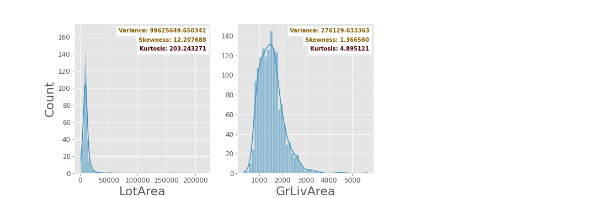<!-- -->

and **after** Box Cox transformation.

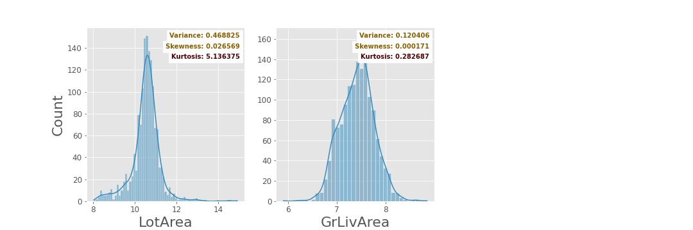<!-- -->

Here are top 30 numeric features correlated with **SalePrice**.  

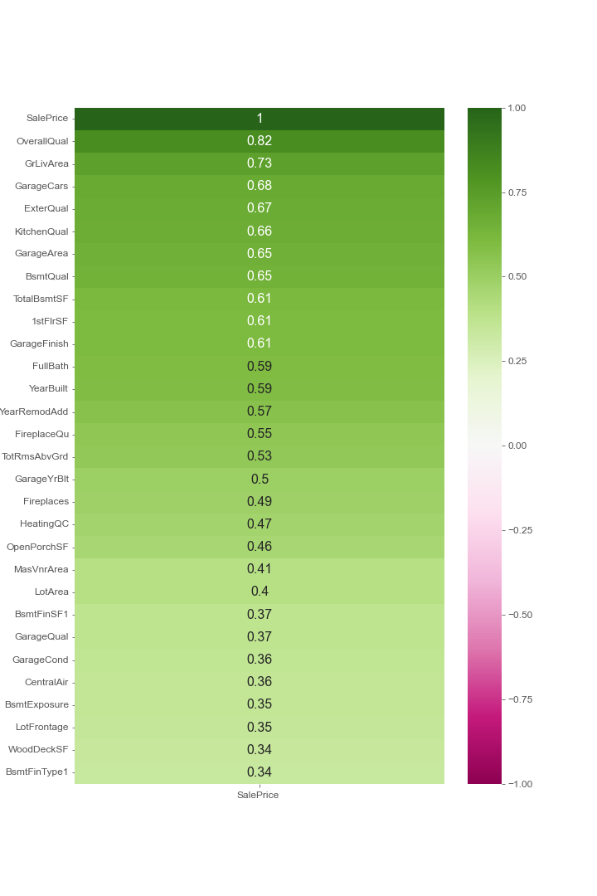<!-- -->

A pairplot was made for the two most highly correlated features:  **OverallQual** and **GrLivArea**.  **OverallQual** is an ordinal variable and makes a great choice as a hue.  The scatter plot shows that **GrLivArea** is strongly correlated with **SalePrice** and identifies at least two potential outliers.  The density plot shows that **OverallQual** is able to separate out different price range.  Houses with **OverallQual = 3** are most abundant and the density of houses decreases as the **OverallQual** increases.

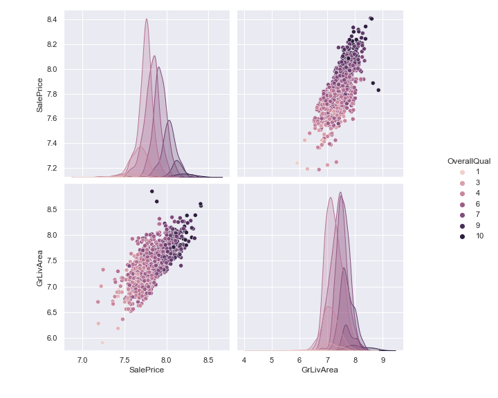<!-- -->

Machine Learning algorithms, such as linear regression, perform poorly when feature variables are highly correlated with each other.  Table below identify pairs of feature variable with covariance > 0.7.  In pair-wise correlation, a feature with a lower correlation to **SalePrice** can be dropped.  In a multicollinearity problem, the feature with the highest correlation to **SalePrice** can be kept while other pairs can be dropped.   

    ## 
    ##             Top Absolute Correlations                                
    ## ---------------------------------------------------------
    ## Feature 1     Feature 2       Correlation
    ## ---------------------------------------------------------
    ## PoolArea      PoolQC          0.900
    ## GarageCars    GarageArea      0.882
    ## Fireplaces    FireplaceQu     0.863
    ## BsmtFinType2  BsmtFinSF2      0.861
    ## GrLivArea     TotRmsAbvGrd    0.826
    ## YearBuilt     GarageYrBlt     0.781
    ## TotalBsmtSF   1stFlrSF        0.742
    ## OverallQual   ExterQual       0.726
    ## ExterQual     KitchenQual     0.716

### 5. EDA of CATEGORICAL FEATURES

Five categorical features had missing values. **MiscFeature** and **Alley** have >90% of values missing and were dropped.  The other three features were imputed with the most frequent.

    ## 
    ##     Categorical Features with Missing Values                                
    ## ---------------------------------------------------------
    ## Variable                   Percentage of Missing Values 
    ## ---------------------------------------------------------
    ## MiscFeature                          96.3% 
    ## Alley                                93.8% 
    ## GarageType                            5.5%
    ## MasVnrType                            0.5%
    ## Electrical                            0.1%

Categorical features can be explored using Box Plot and Count Plot.  The means for the values in *GarageType** correlates with **SalePrice**.  However, outliers are noticeable in Box Plot for Attched, Basement, and Detchd.  The count plot shows that most **GarageType** are Attchd.  

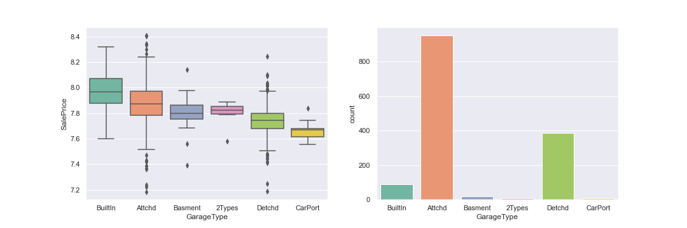<!-- -->

**Neighboorhood** is another important explanatory variable.  No Ridge is the most expensive housing neighborhood in Ames, Iowa.

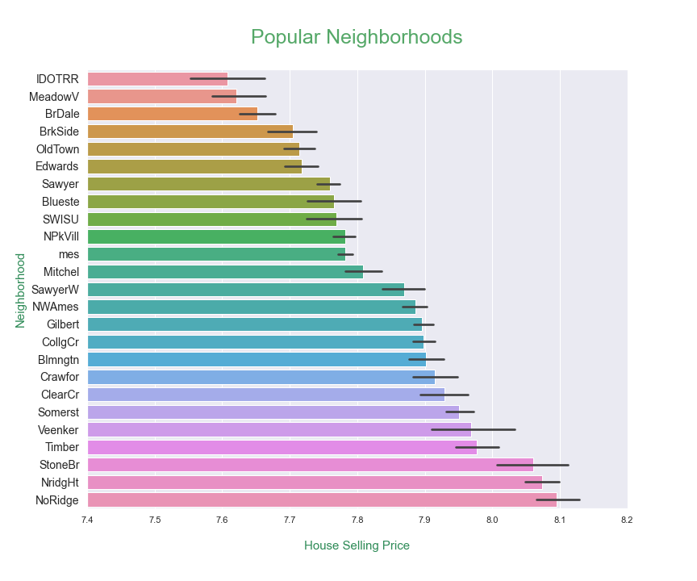<!-- -->

The size of the whiskers in the Box Plot is much larger for Builtin, Attchd, and Detchd than Basement, 2Types, and CarPor, suggesting that the variances within each group is different for each group.  Therefore, I conducted The Kruskal-Wallis H test to calculate the significance of each feature for predicting **SalePRice**. The Kruskal-Wallis H test is a non-parametric rank-based method for testing if two or more groups of independent variables have significant differences.  All features except for **LotConfig** has statistically significant differences between group.  

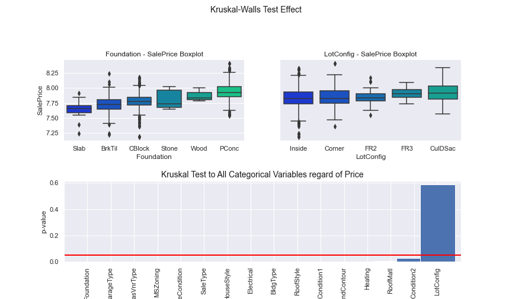<!-- -->

### 6. FEATURE SELECTION

The table below summarizes my feature selection results using five methods:  
1. The absolute value of the covariance (AbsCov) of features with **SalePrice** The table is sorted based on the absolute covariance values.
2. The mutual information score using `SelectKBest` from `sklearn.feature_selection`.  The table shows the mutual information score for each feature.
3. The ANOVA F-score using `SelectKBest` from `sklearn.feature_selection`.  The table shows F-score score for each feature.
4. Forward feature selection using `SequentialFeatureSelector` from `mlxtend.feature_selection` with kselected feature of k=20.  The entries are set to True if selected and False in not selected.
5. Recursive feature selection using `RFE` from `sklearn.feature_selection` with kselected feature of k=20.  The entries are set to True if selected and False in not selected.  

These methods are not comprehensive and future improvements are possible.  For example, I use `LinearRegression` solver from `sklearn` in Forward and Recursive Selection methods, and other solvers such as `SVR` can be used to identify significant features in a non-linear space.  While the kselected feature is set to `k=20`, this is a hyperparameter parameter that can be adjusted.  Nonetheless, this preliminary analysis identifies promising features and provides a useful framework to build on for future works. 

Several trends are noticeable by comparing feature selection methods.  For example, Mutual Information and Anova F-Score generally follows the pattern of AbsCov.  There are a few minor deviations from this trend.  For example, the orders for **Foundation** and **FireplaceQu** are flipped under Mutual Information.  In this regards, the ordering for ANOVA_F appears more consistent with AbsCov.  Forward Selection and Recursive Selection selected different features.  For example, **Neighborhood** was selected by Forward Selector, but not Recursive Selector.  By visual inspection, it appears that Recursive Selector appeared to have selected features with low AbsCov, such as **Utility* and **LowQualFinSF**.  The efficacy of these selections will be evaluated later by using the selected features as the predictors for **SalePrice***.  

    ## 
    ##             Summary of Feature Selection                                
    ## ---------------------------------------------------------
    ## feature      AbsCov 	Mutual 	ANOVA_F Forward	Recursive
    ## OverallQual    0.82 	  0.57 	   2885    True	     True
    ## Neighborhood   0.74    0.52     1784    True     False
    ## GrLivArea 	  0.73    0.48 	   1657    True      True
    ## GarageCars 	  0.68 	  0.37 	   1255    True      True
    ## ExterQual 	  0.67 	  0.32 	   1217   False      True
    ## KitchenQual 	  0.66 	  0.32 	   1154    True      True
    ## GarageArea 	  0.65 	  0.36 	   1065   False     False
    ## BsmtQual 	  0.65    0.33 	   1044    True      True
    ## TotalBsmtSF 	  0.61 	  0.36 	    868    True     False
    ## 1stFlrSF 	  0.61 	  0.30 	    850    True      True
    ## GarageFinish   0.61    0.26 	    846   False     False
    ## FullBath 	  0.59 	  0.26 	    795   False     False
    ## YearBuilt 	  0.59 	  0.36 	    771    True     False
    ## YearRemodAdd   0.57    0.24 	    690   False     False
    ## Foundation 	  0.55 	  0.20 	    634   False     False
    ## FireplaceQu 	  0.55 	  0.21 	    617    True     False
    ## TotRmsAbvGrd   0.53 	  0.21 	    576   False     False
    ## GarageYrBlt 	  0.50 	  0.28 	    485   False     False
    ## Fireplaces 	  0.49 	  0.17 	    457   False     False
    ## HeatingQC 	  0.47 	  0.16 	    424    True     False
    ## OpenPorchSF 	  0.46 	  0.15 	    389   False     False
    ## MasVnrType 	  0.43 	  0.11 	    328   False     False
    ## GarageType 	  0.43 	  0.12 	    327   False     False
    ## MSZoning 	  0.42 	  0.12 	    304   False      True
    ## Exterior1st 	  0.41 	  0.14 	    302   False     False
    ## MasVnrArea 	  0.41 	  0.13 	    288   False     False
    ## Exterior2nd 	  0.40 	  0.17 	    283   False     False
    ## LotArea 	  0.40 	  0.20 	    276    True      True
    ## BsmtFinSF1 	  0.37 	  0.14 	    231   False     False
    ## GarageQual 	  0.37 	  0.07 	    230   False     False
    ## GarageCond 	  0.36 	  0.08 	    222   False     False
    ## CentralAir 	  0.36 	  0.07 	    216    True      True
    ## BsmtExposure   0.35 	  0.08 	    209   False     False
    ## LotFrontage 	  0.35 	  0.20 	    204   False     False
    ## WoodDeckSF 	  0.34 	  0.09 	    190   False     False
    ## SaleType       0.34 	  0.08 	    189   False     False
    ## BsmtFinType1   0.34 	  0.15 	    185    True     False
    ## 2ndFlrSF 	  0.32 	  0.20 	    164   False     False
    ## HouseStyle 	  0.32 	  0.08 	    161   False     False
    ## HalfBath 	  0.31 	  0.08 	    160   False     False
    ## PavedDrive 	  0.31 	  0.05 	    155   False     False
    ## Electrical 	  0.31 	  0.06 	    150   False     False
    ## BsmtCond 	  0.29 	  0.05 	    130   False     False
    ## LotShape 	  0.29 	  0.09 	    129   False     False
    ## SaleCondition  0.27 	  0.07 	    116    True     False
    ## BsmtFullBath   0.24 	  0.03 	     86    True      True
    ## BsmtUnfSF 	  0.22 	  0.13 	     75   False     False
    ## EnclosedPorch  0.22 	  0.02 	     73   False     False
    ## BedroomAbvGr   0.21 	  0.07 	     68   False     False
    ## RoofStyle 	  0.20 	  0.01 	     62   False     False
    ## Condition1 	  0.19 	  0.02 	     57   False     False
    ## Heating 	  0.18 	  0.02 	     52   False     False
    ## BldgType 	  0.18 	  0.04 	     47   False     False
    ## LandContour 	  0.15 	  0.03 	     35   False     False
    ## LotConfig 	  0.15 	  0.01 	     31   False     False
    ## Fence 	  0.14 	  0.05 	     31   False     False
    ## Functiol 	  0.14 	  0.01 	     28    True      True
    ## RoofMatl 	  0.13 	  0.00 	     24   False     False
    ## KitchebvGr 	  0.12 	  0.02 	     21    True      True
    ## Condition2 	  0.11 	  0.00 	     17   False     False
    ## ScreenPorch 	  0.10 	  0.01       15    True      True
    ## PoolQC 	  0.08 	  0.00 	      8   False      True
    ## MiscVal 	  0.07 	  0.00 	      8   False      True
    ## PoolArea 	  0.07 	  0.00 	      7   False     False
    ## Street 	  0.06 	  0.00 	      5   False      True
    ## 3SsnPorch 	  0.06 	  0.01 	      5   False      True
    ## MoSold 	  0.06 	  0.00 	      5   False     False
    ## LowQualFinSF   0.06 	  0.00 	      5   False      True
    ## ExterCond 	  0.05 	  0.02        4   False     False
    ## YrSold 	  0.04 	  0.00 	      2   False     False
    ## LandSlope 	  0.04 	  0.00 	      2   False     False
    ## BsmtFinSF2 	  0.03 	  0.00 	      2   False     False
    ## OverallCond 	  0.03 	  0.11 	      2    True     False
    ## BsmtFinType2   0.02 	  0.03 	      0   False     False
    ## Utilities 	  0.01 	  0.00 	      0   False      True
    ## MSSubClass 	  0.01 	  0.26 	      0   False     False
    ## BsmtHalfBath   0.00 	  0.01 	      0   False     False

### 7. FIND VARIABLES WITH OUTLIERS

Outliers are observations that differ significantly from the bulk of observations.  A box plot shows outliers appear as points outside the whiskers, or mathematically they are defined as points over 1.5 times the interquartile range (IQR) below the first quartile or 1.5 times the IQR above the third quartile.  For example, a plot of **MasVnrType** shows a large number of outliers for two categories:  BrkFace and None.

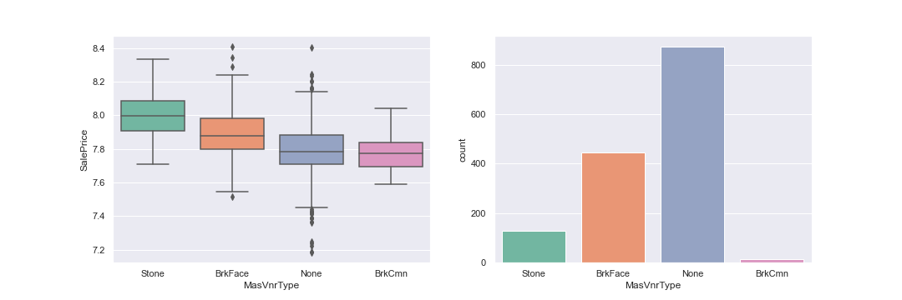<!-- -->

Another way to visualize outliers is by calculating the [Cook's distance](https://medium.com/swlh/identify-outliers-with-pandas-statsmodels-and-seaborn-2766103bf67c), which measures the **influence** of an outlier:  i.e., how much the regression parameters change when an outlier is removed from the calculation.  The influence is the product of the **outlierness** (how far the observation deviates from expectation, aka **residual**) and **leverage** (how far the independent variable deviates from the mean).  Here is [a great tutorial video](https://youtu.be/xc_X9GFVuVU).

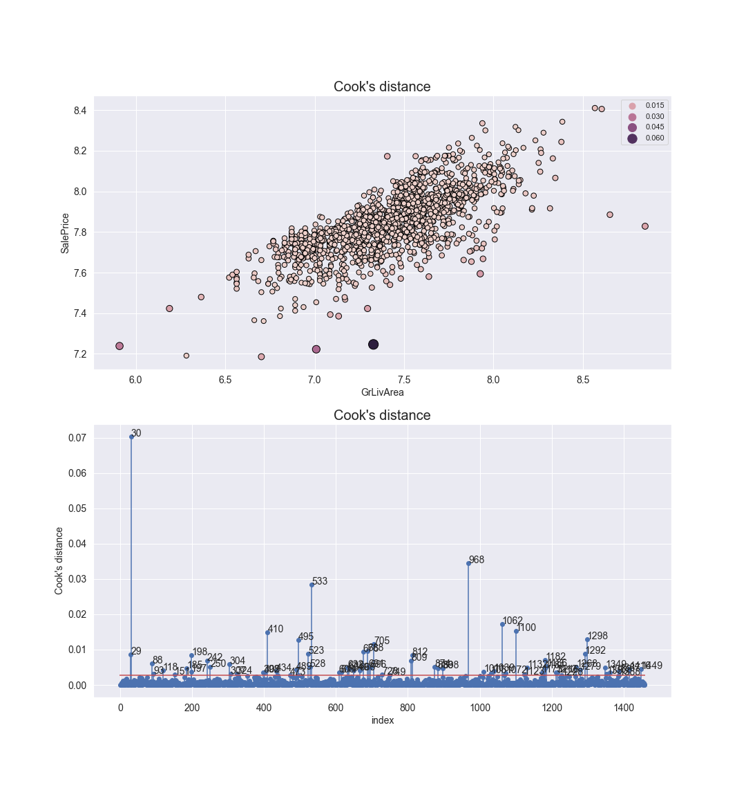<!-- -->

The threshold value for outlier for Cook's outlier can be calculated as D(i) > 4/n or 4/1460 = 0.003 in this case.  For example, 'GrLivArea' has 78 influential outliers.  On average each feature has about 80 outliers as quantified by Cook's distance.

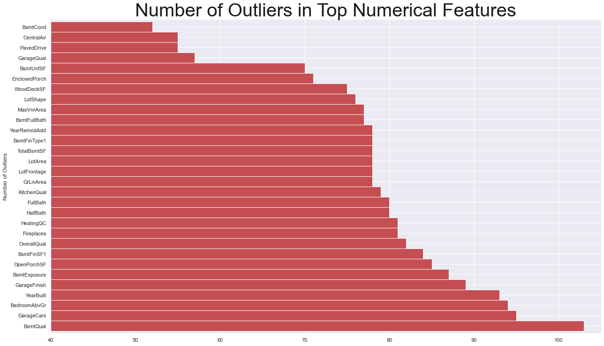<!-- -->

### 8. EXTRA ANALYSIS

I analyze how feature selection decisions affect the model using three models:  Linear Regression, Support Vector Machine (SVM), and Random Forest.  Other regression models can be added; however, that goes beyond the scope of this project.  I perform k-fold cross-validation to test the model performance on unseen data with k=5.  Here is the results for when I include numerical data only.  While five metrics were examined, I will focus only on the Concordance Correlation Coefficient (CCC) only, which shows the agreement between model prediction and actual observation.  When only Numeric Features were used, Linear Regression outperformed other models with CCC = 0.932.

    ## 
    ##    Cross Validation (k=5) Results Numerical Data Only                                
    ## ------------------------------------------------------------
    ##             Model    MAE    MSE   RMSE  R-squared    CCC
    ## Linear Regression  0.037  0.003  0.056      0.870  0.932
    ##    SVM Regression  0.044  0.004  0.066      0.823  0.901
    ##     Random Forest  0.038  0.003  0.057      0.868  0.926

When Categorical Data was included, all models performed better, while Linear Regression still maintained others.

    ## 
    ##    Cross Validation (k=5) Results Numerical and Categoricals                                
    ## -------------------------------------------------------------
    ##             Model    MAE    MSE   RMSE  R-squared    CCC
    ## Linear Regression  0.035  0.003  0.053      0.883  0.939
    ##    SVM Regression  0.040  0.004  0.064      0.835  0.906
    ##     Random Forest  0.037  0.003  0.056      0.875  0.930

Removing the outliers from the training set improved Linear Regression.

    ## 
    ##    Cross Validation (k=5) Results Numerical and Categoricals  
    ##    Outliers removed.
    ## -------------------------------------------------------------
    ##             Model    MAE    MSE   RMSE  R-squared    CCC
    ## Linear Regression  0.033  0.003  0.052      0.889  0.943
    ##    SVM Regression  0.041  0.004  0.066      0.825  0.898
    ##     Random Forest  0.038  0.003  0.058      0.864  0.923
    
Removing the outlierss from the training set improved Linear Regression.

    ## 
    ##    Cross Validation (k=5) Results Numerical and Categoricals  
    ##    Outliers removed.
    ## -------------------------------------------------------------
    ##             Model    MAE    MSE   RMSE  R-squared    CCC
    ## Linear Regression  0.033  0.003  0.052      0.889  0.943
    ##    SVM Regression  0.041  0.004  0.066      0.825  0.898
    ##     Random Forest  0.038  0.003  0.058      0.864  0.923

Applying the filter created from Recursive Feature Selection marginally improved the performance of SVM and marginally decreased the performance of Linear Regression and Random Forest.

    ## 
    ##    Cross Validation (k=5) Results Numerical and Categoricals  
    ##    Outliers removed.  Feature Selected by Recursive Selection.
    ## -------------------------------------------------------------
    ##             Model    MAE    MSE   RMSE  R-squared    CCC
    ## Linear Regression  0.033  0.003  0.052      0.888  0.942
    ##    SVM Regression  0.041  0.004  0.066      0.826  0.899
    ##     Random Forest  0.038  0.003  0.058      0.864  0.923

Projecting the Numeric data onto the first 10 principal component axis determined by Singular Value Decomposition seems to bring modest benefit to Random Forest Regression.

    ## 
    ##    Cross Validation (k=5) Results Numerical and Categoricals  
    ##    Outliers removed.  Feature Transformed by Projecting Onto 
    ##    First 10 Pricipal Component Axis
    ## -------------------------------------------------------------
    ##             Model    MAE    MSE   RMSE  R-squared    CCC
    ## Linear Regression  0.033  0.003  0.051      0.889  0.943
    ##    SVM Regression  0.041  0.004  0.066      0.824  0.898
    ##     Random Forest  0.038  0.003  0.057      0.866  0.925

Overall, the regression analysis showed about ~92.5% agreement between the model and observations.  While regression methods (Linear Regression and SVM) appears to perform better from the removal of outliers, Random Forest is robust to outliers and appears to perform better with the outliers.

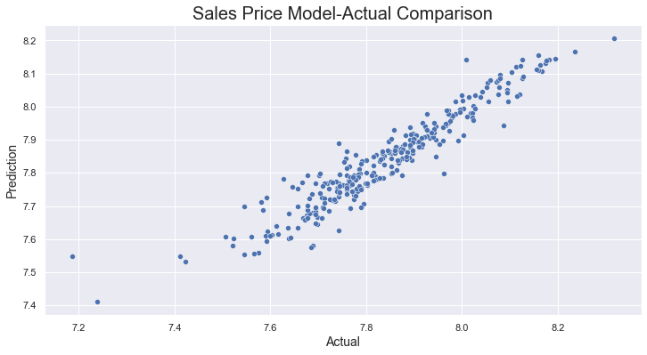<!-- -->

